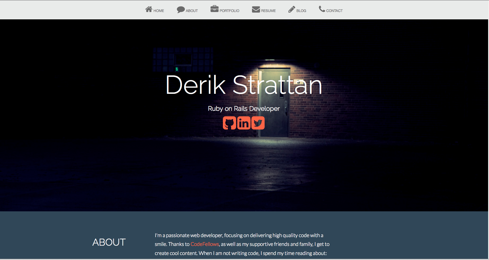

# Derik's Portfolio

By [Derik Strattan](http://www.derikstrattan.com).

## Description
**My personal portfolio** built in Rails 3.2.14, with Twitter Bootstrap and custom themes. This project has multiple branches, mostly for additional features or testing that I did not incorporate into the master. The site is hosted on Heroku, uses [New Relic](www.newrelic.com) for monitoring, and AWS Cloudfront to serve static assets.

## Information

### Known Issues

So far, the tests are working but on a separate branch.

If you discover any bugs, feel free to create an issue on GitHub fork and
send me a pull request.

## Author

* Derik Strattan (http://github.com/Derikulous)

## Contributing

1. Fork it
2. Create your feature branch (`git checkout -b my-new-feature`)
3. Commit your changes (`git commit -am 'Add some feature'`)
4. Push to the branch (`git push origin my-new-feature`)
5. Create new Pull Request

## License

MIT. Give credit if you use any images. Thanks for looking!

